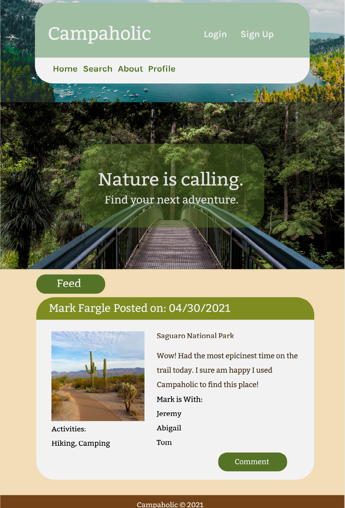
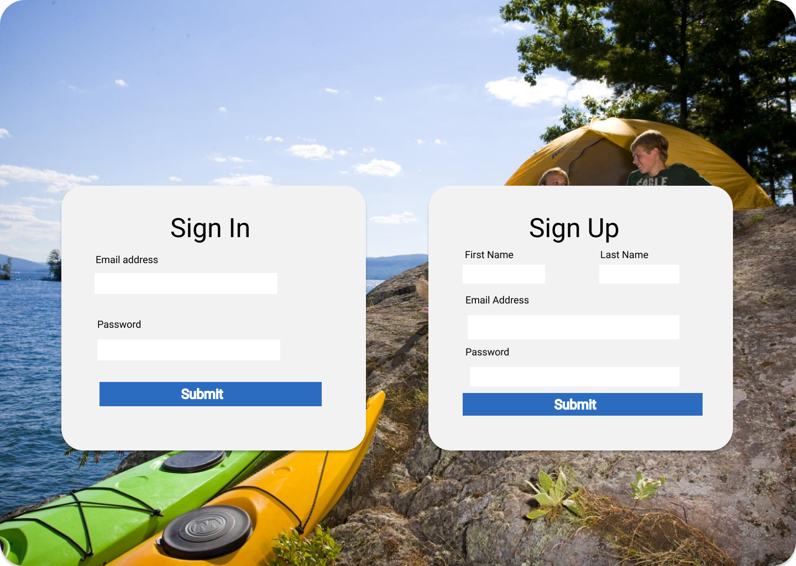
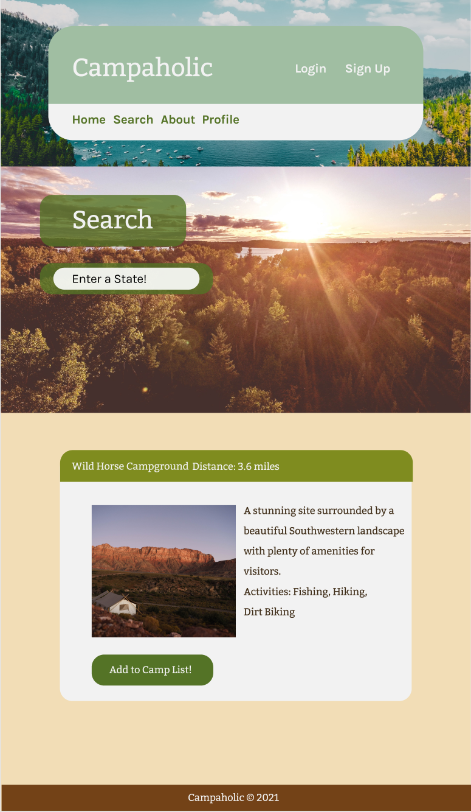

# Campaholic

## Link to Application

# Description
This is an application that will assist the avid and novice camper to find camping locations and plan a camping trip. The app will give the user information on camping sites such as campsite description, images, available activities, available events, and nearby locations such as recreational areas. The app will allow the user to invite friends to join in the camping trip. The user will also be able to determine the length of the trip. The user(s) will be able to communicate about their planned trip through the site by posts/comments. 

# User Story

As an avid and novice camper, I want to easily find good camping locations so that I can plan a camping trip and invite friends to join in the adventure.

# Wireframe/Outline
 ## Homepage
 </img>

 ## Login/Signup page
 </img>

 ## Profile page
 </img>

 ## Search page
 </img>

 ## About
 </img>

# Tasks Breakdown

Wes: Models, api/routes, Third-party API. 

Triston: Third-party API, CSS, HTML, react-components.

Dan: react-app.js, react-components, HTML.

Myrla: react-pages, react-components, CSS. 

*All contributors will participate in all phases of the app as needed. 
